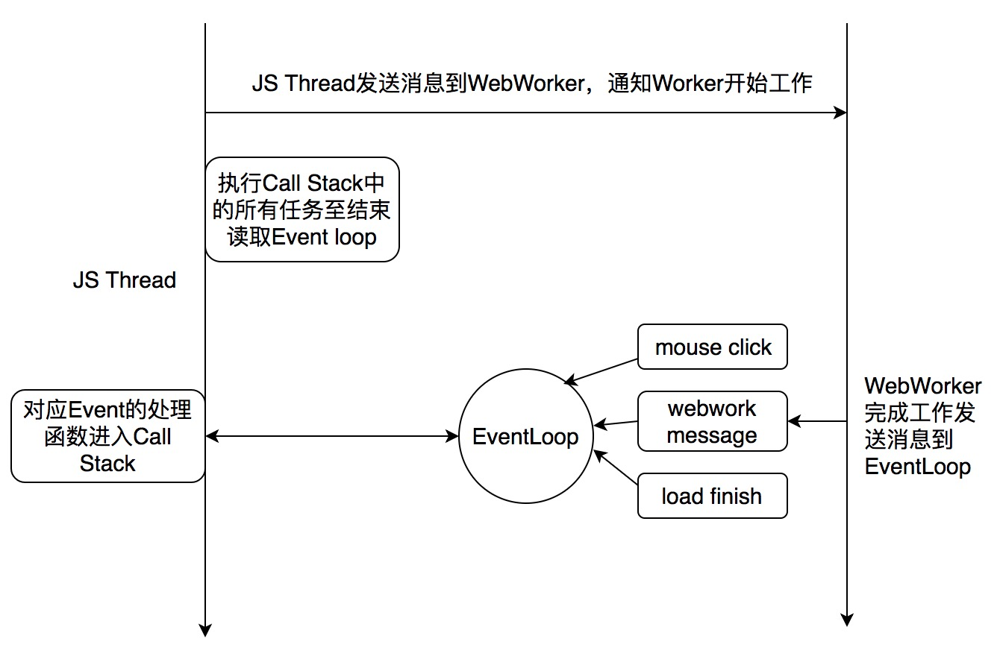

Author: _Yu Li_  
date: _2020/08/01_  

参考[https://tech.meituan.com/2018/08/23/deep-understanding-of-jscore.html](https://tech.meituan.com/2018/08/23/deep-understanding-of-jscore.html)
  
## WebKit

浏览器内核，即WebKit。不同浏览器有自己的内核，Safri浏览器内核就是WebKit。

WebKit模块构成如下：

WebKit由四部分构成，一部分和UI交互，一部分和Native API交互，剩下WebCore是渲染引擎，JSCore是JS引擎。

## WebCore

`渲染引擎`：对HTML和CSS进行解析，生成DOM和CSSOM，合并输出成渲染树。

## JSCore

JSCore是WebKit默认内嵌的JS引擎。例如Chrome的V8引擎，目的都是为了解释并执行JS脚本。

JSCore工作流程如图：

主要分为三部分：词法分析、语法分析和解释执行。

### 词法分析-Lexer

把一段代码分解成Token序列的过程，也叫`分词`。Lexer不关心每个Token之间的关系，而是等语法分析把这些Token“串起来”。

词法分析一般是由语法分析器（Parser）来进行调用的。JSCore中，词法分析器Lexer的代码主要集中在parser/Lexer.h、Lexer.cpp中。

### 语法分析-Parser

Parser会把Lexer分析之后的token序列进行语法分析，并生成一颗抽象语法树（AST）。可以通过[https://esprima.org/demo/parse.html](https://esprima.org/demo/parse.html)实时查看js语句生成的AST。

之后，ByteCodeGenerator会根据AST来生成JSCore的`字节码`，完成整个语法解析步骤（即`编译`）。

### 解释执行-LLInt和JIT

不同于我们编译运行OC（Objective-C）代码，JS编译结束之后，并不会生成存放在内存或者硬盘之中的目标代码或可执行文件。生成的`指令字节码`（ByteCode），会被立即被JSCore这台虚拟机进行逐行解释执行。

### 事件驱动机制

工作线程(WebWorker，JS宿主提供，和JS线程不在同一个运行环境，不共享一个作用域，故工作线程不能操作window和DOM)和事件驱动机制的存在，才让JS有了多线程异步能力。

